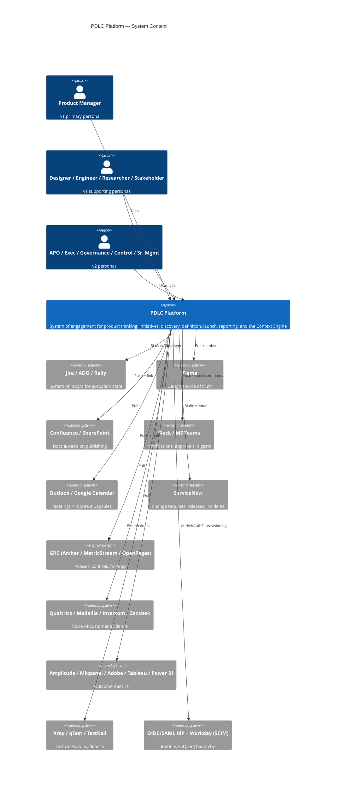
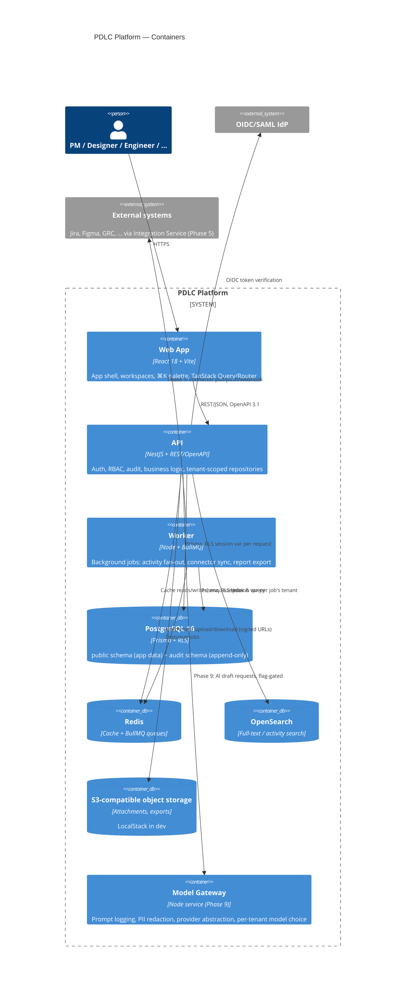

# 02 — Architecture

## C4: System Context

Who and what talks to the platform. Full connector list: [05-integration-strategy.md](05-integration-strategy.md).

## C4: Containers

## Runtime shape

- **Stateless app tier** (`apps/web`, `apps/api`): horizontally scalable, no in-process session state. Auth state lives in the verified JWT (OIDC) or dev-stub headers; request-scoped state lives in `AsyncLocalStorage` (`RequestContext`), not anywhere shared across requests.
- **Background jobs** (`apps/worker`) run on BullMQ/Redis, independently scalable from the API.
- **Tenant isolation** is enforced twice: application-layer (`TenantScopedRepository` always filters by `tenantId`) and database-layer (Postgres RLS policy keyed on a `SET LOCAL` session variable). See [ADR-0002](06-adr/ADR-0002-multi-tenancy-rls.md).
- **Data residency**: each tenant is pinned to one region (`Tenant.residencyRegion`); production topology runs one full stack per region rather than sharding a single database across regions.
- **Self-hosted connector agent** (Phase 5, banks with no SaaS egress): an outbound-only agent inside the customer network speaks to the Integration Service; the architecture above already treats "connectors" as external to the API/worker boundary so this doesn't require a redesign later.

## Observability

OpenTelemetry auto-instrumentation (HTTP, Prisma) bootstraps before any other import in `apps/api/src/main.ts`; traces export via OTLP when `OTEL_EXPORTER_OTLP_ENDPOINT` is set, no-op otherwise. Structured JSON logs (pino) carry a correlation id (`x-request-id`) shared between access logs and `RequestContext`. `/health` (liveness) and `/ready` (readiness — DB reachable) exist on both `apps/api` and `apps/worker`.
