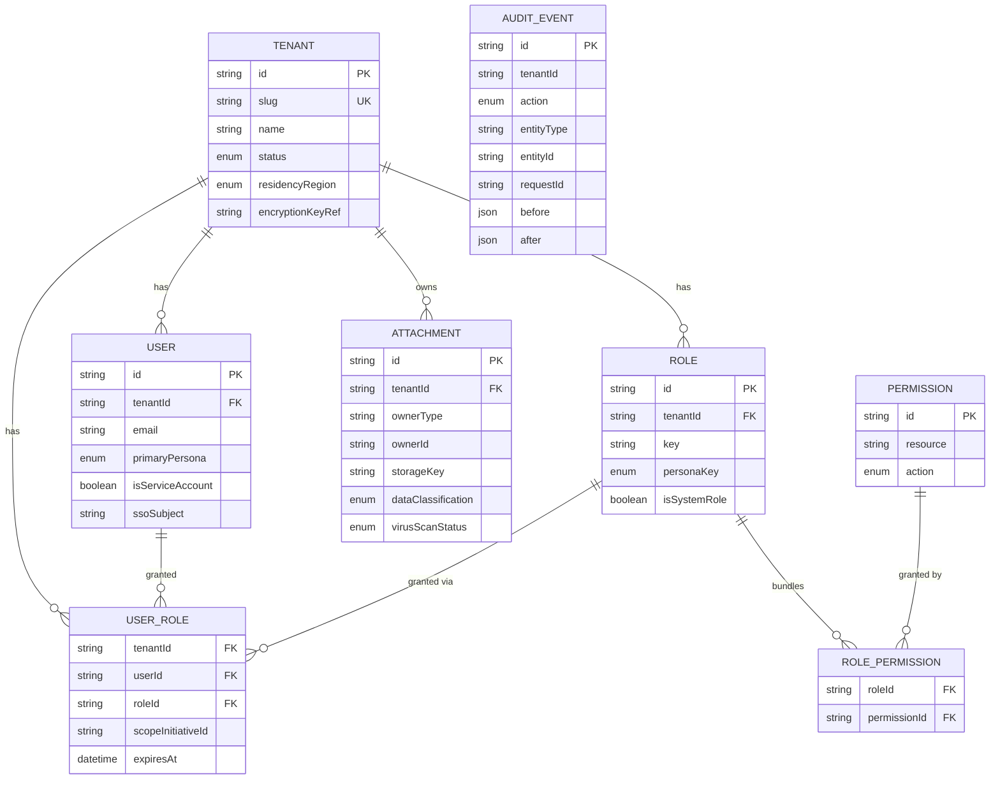
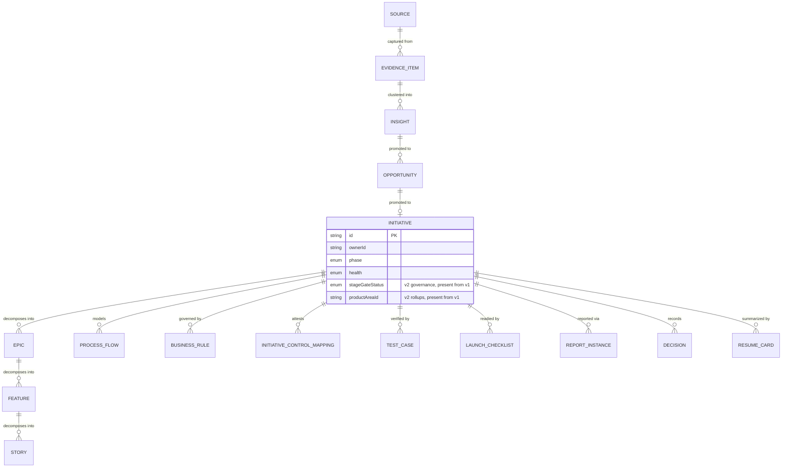

# 03 — Data Model

## Phase 0: what's actually in Postgres today

Source of truth: `apps/api/prisma/schema.prisma`. Everything here is tenant-scoped and RLS-protected except `Permission` (global catalogue) and `Tenant` itself (see [ADR-0002](06-adr/ADR-0002-multi-tenancy-rls.md)).

`AUDIT_EVENT` lives in the separate `audit` Postgres schema, append-only, with no FK to app tables by design (audit must survive the row it describes being deleted).

## Forward-declared: the full domain model

`packages/shared-types` already defines the shape of every module in the build sequence (A8) so later phases don't churn types PMs' UIs or the API depend on. **None of the entities below exist as Prisma models / DB tables yet** — they land phase by phase via expand/contract migrations. This diagram is the conceptual map, not a current schema.

Full field-level detail for every entity lives in `packages/shared-types/src`, one file per module (`initiative.ts`, `discovery.ts`, `definition.ts`, `experience.ts`, `launch.ts`, `reporting.ts`, `quality.ts`, `context-engine.ts`, `integration.ts`). When a phase implements a module, its Prisma models should mirror the corresponding shared-types file field-for-field — that file is the spec.

## Migration discipline

Expand/contract only (CLAUDE.md): add nullable columns or new tables in one migration, backfill, then a later migration tightens constraints — never a single migration that both adds a NOT NULL column and ships code that requires it. See [ADR-0002](06-adr/ADR-0002-multi-tenancy-rls.md) for how RLS policies get added to each new tenant-scoped table as it's created.
